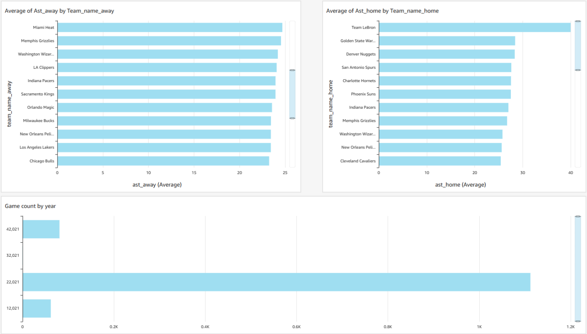

# aws-nba-analytics-pipeline
Serverless AWS data pipeline for NBA analytics using S3, Lambda, Glue, Athena, QuickSight, Python, and SQL.

## Project Overview

This project was developed as a team-based cloud engineering project focused on building a serverless analytics pipeline for NBA data using Amazon Web Services.

The pipeline stored NBA game data in Amazon S3, used AWS Lambda and Glue Crawlers to automate data catalog updates, queried the resulting datasets with Amazon Athena, and supported visualization through Amazon QuickSight.

The project demonstrates experience with cloud-based data pipelines, Python automation, SQL querying, AWS service integration, IAM configuration, and business intelligence reporting.

## Architecture

The project used a serverless AWS analytics pipeline:

```text
External NBA Data
        ↓
     Amazon S3
        ↓
     AWS Lambda
        ↓
 AWS Glue Crawler
        ↓
AWS Glue Data Catalog
        ↓
   Amazon Athena
        ↓
 Amazon QuickSight
```

NBA game data was stored in Amazon S3, AWS Lambda triggered Glue crawlers to update the data catalog, Athena was used to query the data, and QuickSight provided the visualization layer.

## AWS Services Used

- **Amazon S3** — Stored the NBA game and team datasets used as the source layer for the analytics pipeline.
- **AWS Lambda** — Automated the workflow by triggering AWS Glue crawlers and initiating the QuickSight dataset refresh.
- **AWS Glue Crawler** — Scanned data stored in S3 and updated table metadata.
- **AWS Glue Data Catalog** — Maintained metadata and table definitions used by Athena.
- **Amazon Athena** — Queried and joined NBA datasets using SQL.
- **Amazon QuickSight** — Visualized NBA metrics and created the final analytics dashboard.
- **AWS IAM** — Managed permissions between services and users within the AWS environment.
- **Python / boto3** — Used inside Lambda to automate AWS service interactions.
- **SQL** — Used in Athena to query and combine the NBA datasets.

## Team Project & My Contributions

This project was completed collaboratively as part of a cloud engineering course at Saint Mary's College of California. The team designed and implemented a serverless AWS analytics pipeline for NBA data.

My primary contributions included:

- **AWS Lambda** — Configured and developed the Python/boto3 Lambda workflow used to trigger AWS Glue crawlers and initiate the QuickSight dataset refresh.
- **AWS IAM** — Configured IAM roles and permissions to support communication between Lambda, Glue, Athena, and S3.
- **AWS Glue Crawlers** — Configured crawlers to scan NBA data stored in S3 and update table metadata in the AWS Glue Data Catalog.
- **Amazon Athena** — Developed SQL queries to join and analyze NBA game and team-level datasets using the tables cataloged through AWS Glue.

## Limitations & Improvements

The project successfully demonstrated a serverless AWS analytics pipeline, but the original implementation had several areas that could be improved for a production environment.

- **Broad IAM permissions** — Some roles used permissions that were wider than necessary. A production implementation should follow the principle of least privilege and restrict access to only the required services and resources.
- **Lambda execution timing** — The Lambda workflow used a fixed wait period before refreshing the QuickSight dataset. A more robust implementation could check the AWS Glue crawler status before continuing.
- **Configuration management** — AWS resource identifiers should be stored as environment variables rather than hard-coded directly in application code.
- **Scalability and query performance** — Larger datasets could benefit from partitioning and columnar formats such as Parquet to reduce Athena scan volume and improve query performance.
- **Pipeline automation** — Additional event-driven automation could reduce the need for manual data ingestion and make the pipeline easier to maintain.

## Proposed Alternative Architecture

The team also evaluated Amazon Redshift as an alternative architecture for workloads that could benefit from a persistent cloud data warehouse.

A potential architecture would be:

```text
External NBA Data
        ↓
     Amazon S3
        ↓
     AWS Lambda
        ↓
  Amazon Redshift
        ↓
 Amazon QuickSight
```

Redshift could provide an alternative for workloads requiring more persistent warehouse-style analytics, higher query concurrency, or integration with additional reporting applications. The serverless S3, Glue, and Athena architecture remained appropriate for the scope of the original project.

## QuickSight Dashboard

Amazon QuickSight was used to visualize NBA metrics after the data was stored in S3, cataloged through AWS Glue, and queried using Athena.



## Repository Structure

```text
aws-nba-analytics-pipeline/
├── README.md
├── .gitignore
├── src/
│   └── lambda_refresh_pipeline.py
├── sql/
│   └── athena_queries.sql
└── screenshots/
    └── quicksight_dashboard.png
```

### Files

- `src/lambda_refresh_pipeline.py` — Python/boto3 Lambda workflow used to trigger AWS Glue crawlers and initiate the QuickSight dataset refresh.
- `sql/athena_queries.sql` — Amazon Athena SQL used to join and query NBA game and team-level data.
- `screenshots/quicksight_dashboard.png` — Screenshot of the final Amazon QuickSight analytics dashboard.
